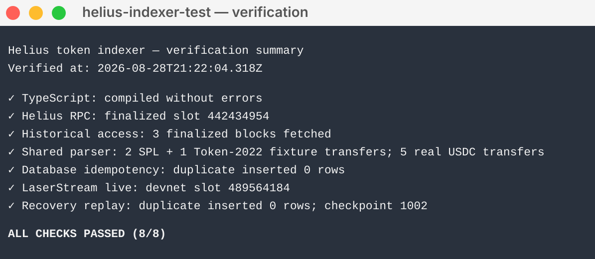

# Solana Token Transfer Indexing

This repository is a technical reference and proof of concept for the customer’s engineering team to build a resilient ~30-day token transfer index on Solana.

## Recommendation

I would build the index with two ingestion paths:

- Helius historical data to backfill the last ~30 days.
- LaserStream to continuously ingest new transactions.

Both paths use the same parsing and database logic:

```text
                  Solana
                    |
          +---------+---------+
          |                   |
   Historical Data       New Transactions
          |                   |
   Helius Archival        LaserStream
          |                   |
          +---------+---------+
                    |
                    v
              Transfer Indexer
          parse -> filter -> normalize
                    |
                    v
                 Database
          transfers + checkpoint
```

I would start LaserStream before or alongside the historical backfill. This may create some overlap, but that is intentional: duplicates are easy to remove; missing transfers are harder to recover.

### Assumptions

I assume “major tokens” means a configured allowlist of mint addresses, such as USDC, and that the customer wants transfers for those tokens across Solana rather than activity for a predefined set of wallets.

---

## 1. Backfill the Last 30 Days

For the initial index, I would use Helius archival infrastructure to retrieve historical transactions over the required slot range.

For a network-wide index of high-volume tokens, one option is to go through historical blocks and inspect the transactions in each one:

```ts
const rpc = createSolanaRpc(HELIUS_RPC_URL);

async function backfill(startSlot: bigint, endSlot: bigint) {
  for (const range of chunkSlotRange(startSlot, endSlot)) {
    const slots = await rpc
      .getBlocks(range.start, range.end, {
        commitment: "finalized",
      })
      .send();

    for (const slot of slots) {
      const block = await rpc.getBlock(slot, {
        commitment: "finalized",
        encoding: "jsonParsed",
        transactionDetails: "full",
        maxSupportedTransactionVersion: 0,
      }).send();

      if (!block) continue;

      const transfers = extractTargetTransfers(block, TARGET_MINTS);
      await persistTransfers(transfers);
    }
  }
}
```

The sample leaves out one conversion step to keep it readable. In the full implementation, both historical data and LaserStream updates would be converted into the same transaction format before going through the transfer parser.

In production, I would process a limited number of blocks at the same time, retry temporary failures with increasing wait times, and save progress so the backfill can continue where it left off after a crash.

For a larger customer, I would also consider Helius managed historical-data delivery instead of having them run a large RPC scan themselves.

---

## 2. Keep the Index Current with LaserStream

Once the index is running, I would use LaserStream to receive new Solana transactions continuously.

```ts
const request: SubscribeRequest = {
  transactions: {
    tokenTransactions: {
      accountInclude: [TOKEN_PROGRAM_ID, TOKEN_2022_PROGRAM_ID],
      accountExclude: [],
      accountRequired: [],
      vote: false,
      failed: false,
    },
  },
  commitment: CommitmentLevel.CONFIRMED,
  accounts: {},
  slots: {},
  transactionsStatus: {},
  blocks: {},
  blocksMeta: {},
  entry: {},
  accountsDataSlice: [],
};

await subscribe(config, request, async (update) => {
  if (!update.transaction) return;

  const tx = normalizeLaserStreamTransaction(update);
  const transfers = extractTargetTransfers(tx, TARGET_MINTS);
  await persistTransfers(transfers);
});
```

I would subscribe broadly to SPL Token and Token-2022 activity, then filter for the customer’s target mint addresses inside the indexer.

Both paths produce the same transfer format before writing to the database, so the database logic does not need to care where the transfer came from.

---

## 3. Parse Solana Transfers Correctly

A Solana transaction can contain multiple instructions and therefore multiple token transfers.

Some transfers happen inside inner instructions when programs call other programs, so the parser needs to check both top-level and inner instructions.

For each transfer I would store fields such as:

```text
signature
slot
block_time
mint
source_token_account
destination_token_account
source_owner
destination_owner
amount_raw
decimals
instruction_index
inner_instruction_index
```

The parser should handle both SPL Token and Token-2022 `Transfer` / `TransferChecked` instructions.

A unique transfer ID can be built from its location inside the transaction:

```text
signature + instruction_location
```

Using the signature alone is not enough because one transaction can contain several transfers.

---

## 4. Make Recovery Safe

Database writes should be safe to repeat. If the same transfer is processed twice, it should still only create one row.

```sql
INSERT INTO token_transfers (...)
VALUES (...)
ON CONFLICT (signature, instruction_location) DO NOTHING;
```

I would also save the last point the application successfully finished indexing so it has a checkpoint to recover from after a crash.

### Short outage

```text
LaserStream reconnects
        |
        v
replay recent data
        |
        v
idempotent writes discard overlap
```

### Long outage

```text
read last durable checkpoint
        |
        v
use Helius archival data to catch up
        |
        v
resume LaserStream
```

I would restart slightly before the checkpoint instead of relying on an exact boundary. Any overlap is safe because duplicate transfers are ignored by the database.

The goal is to make sure we never leave a gap, even if that means safely processing some data more than once.

---

## Production Considerations

Before production rollout, I would check:

- how much transfer traffic the selected tokens generate;
- whether the Helius plan can support the backfill volume we need;
- how the system behaves if the database starts falling behind;
- how retries and alerts work when parsing or RPC calls fail;
- whether the database has the right indexes for common queries such as mint, wallet, and time;
- how we measure ingestion lag and detect missing ranges;
- whether recent indexed ranges still match the archival data.

---

## Validation

I built and ran a small proof of concept locally to check the important parts of this design. The project in this repository includes tests for:

- Helius RPC connectivity at `finalized` commitment;
- historical block access;
- SPL Token and Token-2022 transfer parsing;
- parsing a real finalized USDC transaction from Helius;
- repeat-safe PostgreSQL-style writes using a deterministic transfer ID;
- LaserStream live delivery;
- replay and recovery with a saved checkpoint;
- keeping separate transfer rows when one transaction contains multiple transfer instructions.

The tests use small ranges and focused examples. They are meant to check the design and failure handling, not run a production-scale 30-day network-wide backfill.

See [`TESTING.md`](./TESTING.md) for the verification checklist and commands.



---

## References

- [Helius LaserStream](https://www.helius.dev/laserstream) — live streaming, automatic reconnects, and up to 24 hours of historical replay.
- [Helius Historical Data](https://www.helius.dev/historical-data) — historical backfills and structured delivery to destinations including S3, ClickHouse, and PostgreSQL.
- [Helius: How to Index Solana Data](https://www.helius.dev/docs/rpc/how-to-index-solana-data) — Helius guidance on historical indexing approaches and keeping indexes current.

---

## Project Structure

```text
src/
  01-rpc-test.ts
  02-block-test.ts
  03-parser-test.ts
  03b-real-parser-test.ts
  04-db-test.ts
  05-laserstream-test.ts
  05b-laserstream-websocket-test.ts
  06-replay-test.ts
  helius-parsed-transaction-adapter.ts
  token-transfer-parser.ts
sql/
  schema.sql
TESTING.md
.env.example
```

## Summary

The architecture uses:

- Helius historical data to build the initial 30-day index and repair long outages;
- LaserStream to ingest new transactions;
- the same parser for both historical and live data;
- database writes that safely ignore duplicates;
- a saved checkpoint for recovery.

This keeps the system relatively simple while covering the three core requirements: backfill, live ingestion, and failure recovery.
